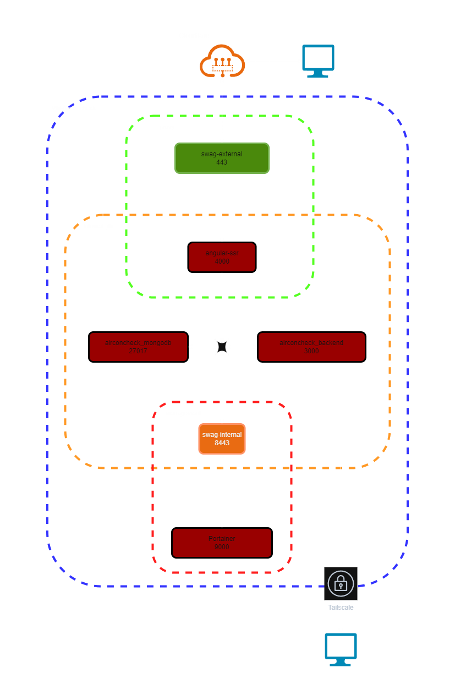

# AirconCheck Infra — Deployment & Configuration Guide

This repository contains the Ansible-based infrastructure configuration for the AirconCheck project.

---

## 🌐 Inventory Structure

Each environment (`dev`, `test`, `prod`) has its own isolated inventory under `inventories/`, each with its own `hosts` and `group_vars/` structure. This ensures clean separation and security.

---

## 🚀 Playbooks

### ▶️ site.yml

Main playbook. Deploys all services and config (users, docker, SWAG, etc.)

```bash
ansible-playbook playbooks/site.yml -i inventories/test/
ansible-playbook playbooks/site.yml -i inventories/dev/
ansible-playbook playbooks/site.yml -i inventories/prod/
```

### 🛠️ debug-vars.yml

Prints key variable values for a host.

```bash
ansible-playbook playbooks/debug-vars.yml -i inventories/test/
```

---

## 📦 Deployed Containers

| Service         | Image                           | Ports             | Description                     |
|-----------------|---------------------------------|-------------------|---------------------------------|
| angular-ssr     | node:20 + build SSR             | 4000 (internal)   | Frontend Angular SSR            |
| landpage        | nginx:alpine                    | 80 (internal)     | Static landing page (public via SWAG) |
| portainer       | portainer/portainer-ce:2.27.1   | 9000              | Docker UI                       |
| swag-external   | linuxserver/swag:3.3.0          | 443, 80           | Public-facing reverse proxy     |
| swag-internal   | linuxserver/swag:3.3.0          | 8443              | Internal reverse proxy          |
| backend         | node:20 (Express)               | 3000 (internal)   | Backend API (served via SWAG)   |
| mongodb         | mongo:8.0.8-noble               | 27017-27019       | MongoDB replica set             |

---

## 🌍 URLs per Environment

Public endpoints (via swag-external):

| Environment | Frontend                        | Landpage                            | API                         |
|-------------|---------------------------------|-------------------------------------|-----------------------------|
| prod        | https://airconcheck.com or https://app.airconcheck.com (toggle) | https://airconcheck.com or https://landpage.airconcheck.com | https://api.airconcheck.com |
| test        | https://test.airconcheck.com    | https://landpage.test.airconcheck.com | https://api.test.airconcheck.com |
| dev         | https://dev.airconcheck.com     | https://landpage.dev.airconcheck.com  | https://api.dev.airconcheck.com  |

Internal endpoints (via swag-internal):

| Environment | Portainer                                   | Homepage                                   | Notes |
|-------------|---------------------------------------------|--------------------------------------------|-------|
| prod        | https://portainer.airconcheck.com:8443      | https://homepage.airconcheck.com:8443      |       |
| test        | https://portainer.test.airconcheck.com:8443 | https://homepage.test.airconcheck.com:8443 |       |
| dev         | https://portainer.dev.airconcheck.com:8443  | https://homepage.dev.airconcheck.com:8443  |       |

---

## 🔐 Secrets Management

Sensitive variables are stored in `group_vars/secrets.yml`, which is ignored by Git.

- A template file (`group_vars/secrets.yml.example`) is provided.
- Copy and fill with your own values before running Ansible playbooks:

```bash
cp group_vars/secrets.yml.example group_vars/secrets.yml
vim group_vars/secrets.yml
```

You can also use the included Makefile helpers:

```bash
# Create secrets.yml from example if missing
make secrets-init

# Check status (plain/encrypted/missing)
make secrets-status

# Encrypt, edit, view, or rekey with Ansible Vault
make secrets-encrypt
make secrets-edit
make secrets-view
make secrets-rekey
```

---

## 🔧 Network Overview


[proxy]
 ├─ angular-ssr (4000)
 ├─ backend (3000)
 └─ swag-external (443/80)
   ↑ public endpoints (wildcard certs)

[internal_db]
 ├─ angular-ssr
 ├─ backend
 └─ mongodb (27017-27019)

[management]
 ├─ portainer (9000)
 └─ swag-internal (8443)
   ↑ private endpoints
     
---

## 🧭 Internal DNS (CoreDNS) and Split DNS

Private, per-environment DNS is provided by a lightweight CoreDNS container that runs on each server. This lets you resolve environment domains (for example, dev.airconcheck.com and all subdomains) only when you’re connected via Tailscale, without exposing these records publicly.

### What it’s for
- Resolve internal hostnames like backend.dev.airconcheck.com, homepage.dev.airconcheck.com, or dev.airconcheck.com itself.
- Reach services bound to the host via the Tailscale IP (for example, MongoDB on dev.airconcheck.com:27017-27019).
- Keep environments isolated: each inventory can define its own DNS zone(s).

### How it works
- The Ansible role `roles/coredns` renders a Corefile and zonefiles from variables and runs a CoreDNS container.
- The container binds to the host’s Tailscale IP on port 53 (both UDP/TCP).
- For names outside your zones, CoreDNS forwards queries to the configured forwarders or to /etc/resolv.conf as a safe fallback.

### Enable per environment
- Toggle with `coredns_enabled` in `inventories/<env>/group_vars/<env>.yml`.
- Dev is enabled by default. Test/Prod can opt in as needed.

Example (already present in `inventories/dev/group_vars/dev.yml`):

```yaml
coredns_enabled: true
coredns_zones:
  - zone: dev.airconcheck.com
    records:
      - type: A
        name: '@'      # apex → dev.airconcheck.com
        value: TAILSCALE_SELF
      - type: A
        name: '*'      # wildcard → anything.dev.airconcheck.com
        value: TAILSCALE_SELF
```

### Variable reference
- `coredns_enabled` (bool): enable/disable CoreDNS for the environment.
- `coredns_bind_ip` (string, optional): IP to bind for DNS. If empty, auto-detected from `tailscale0`.
- `coredns_forwarders` (list): upstream DNS servers for non-authoritative queries. If empty/omitted, CoreDNS falls back to `/etc/resolv.conf`.
- `coredns_compose_path` (string): where CoreDNS files live on the host (default derives from `global_defaults.app_base_path`).
- `coredns_zones` (list): the per-environment DNS zones and records to serve.

`coredns_zones` schema:

```yaml
coredns_zones:
  - zone: <zone-name>
    records:
      - type: A|CNAME|TXT
        name: <record-label or '@' for apex or '*' for wildcard>
        value: <IP|target|text|TAILSCALE_SELF>
```

Notes:
- Use `@` for the zone apex and `*` for wildcard subdomains.
- `TAILSCALE_SELF` is replaced at render time with the effective bind IP (typically the host’s Tailscale IP). This keeps zonefiles portable.

### Tailscale Split DNS setup
To make clients resolve your private zones through the host’s CoreDNS, configure Split DNS in the Tailscale admin console:
- DNS > Nameservers: add the server’s Tailscale IP (for example, 100.x.y.z) as a nameserver.
- Restrict it to the domains you want to serve (for example, `dev.airconcheck.com`).
- Ensure your device is connected to the same Tailscale tailnet; MagicDNS may be used in combination if desired.

Split DNS: “longest suffix wins”
- Si defines `airconcheck.com`, `dev.airconcheck.com` y `test.airconcheck.com`, las consultas a dev/test irán a sus respectivos servidores (más específicos) y no caerán en las reglas de `airconcheck.com`.
- Ejemplo:
  - `portainer.airconcheck.com` → servidor CoreDNS de prod.
  - `dev.airconcheck.com` o `*.dev.airconcheck.com` → servidor CoreDNS de dev.
  - `test.airconcheck.com` o `*.test.airconcheck.com` → servidor CoreDNS de test.

### Verify DNS resolution
From any Tailscale-connected client (or from the server itself):
- Query the apex and a wildcard subdomain:
  - `dig dev.airconcheck.com A`
  - `dig homepage.dev.airconcheck.com A`
- You should get the host’s Tailscale IP as the answer when using the `TAILSCALE_SELF` pattern.

If you want to target CoreDNS directly, you can also run: `dig @<tailscale-ip> dev.airconcheck.com`.

### Example: connect to MongoDB via internal DNS
When CoreDNS is enabled in dev, MongoDB members are reachable at:
- `dev.airconcheck.com:27017`
- `dev.airconcheck.com:27018`
- `dev.airconcheck.com:27019`

Replica set connection string example:

```
mongodb://<user>:<pass>@dev.airconcheck.com:27017,dev.airconcheck.com:27018,dev.airconcheck.com:27019/?replicaSet=rs0&authSource=admin
```

The playbook includes an opt-in, safe two-phase procedure to reconfigure members to public hostnames once connectivity is confirmed. Gate it with `mongodb_public_member_dns: true` in `inventories/dev/group_vars/dev.yml` and re-run the play.

### Modo comodín sintético para prod
Para no fijar la IP pública del apex, en prod usamos un modo de "comodín sintético + forward":
- `*.airconcheck.com` se responde localmente (IP Tailscale del host de prod).
- `airconcheck.com` (apex) y demás nombres no coincidentes se reenvían a Internet (forwarders o `/etc/resolv.conf`).
Esto permite que un cambio de IP pública se refleje automáticamente al actualizar los DNS públicos, sin tocar Ansible.

### Landing page (nginx) y dominios

- Nuevo contenedor `landpage` (nginx)
  - DEV/TEST: expuesto en `https://landpage.<env>.airconcheck.com` a través de `swag-external`.
  - PROD: controlado por `landpage_apex_enabled` en `inventories/prod/group_vars/prod.yml`.
    - `true`: `airconcheck.com` apunta a Landpage y `angular-ssr` pasa a `app.airconcheck.com`.
    - `false`: Landpage en `landpage.airconcheck.com` y `angular-ssr` permanece en `airconcheck.com`.

Variables de inventario relevantes:

```yaml
# dev/test
deploy_landpage: true

# prod
deploy_landpage: true
landpage_apex_enabled: false  # si true, angular-ssr → app.airconcheck.com y landpage → airconcheck.com
```

### Troubleshooting
- Check the container and compose files under `{{ app_base_path }}/coredns` (by default `/opt/airconcheck/coredns`).
- Ensure port 53/udp and 53/tcp are bound to the Tailscale IP (not 0.0.0.0 unless intended).
- If non-authoritative lookups fail, verify `coredns_forwarders` or the `/etc/resolv.conf` fallback on the host.
- Confirm your Tailscale Split DNS points the intended zone(s) to the server’s Tailscale IP.
- CoreDNS reloads on file changes; if in doubt, redeploy the role via the main playbook.

---

## 📦 Optional Code Deployment for Frontend and Backend

To simplify development workflows, AirconCheck supports optional automatic copying of pre-built frontend (Angular SSR) and backend (Node.js) code to the target server.

You can control this behavior per environment by toggling the following variables in your inventory (e.g., `inventories/test/group_vars/test.yml`):

```yaml
# Copy frontend Angular SSR build to the target server
angular_ssr_copy_build: true

# Copy backend Node.js code to the target server
backend_copy_build: true
```

### 🧠 How it works

- When `angular_ssr_copy_build` is `true`, Ansible will copy the contents of `dist/` (Angular SSR build) to:
  ```
  /opt/airconcheck/angular-ssr/
  ```

- When `backend_copy_build` is `true`, Ansible will copy the contents of your local `backend/` folder to:
  ```
  /opt/airconcheck/backend/
  ```

- If either variable is not defined or set to `false`, the copy step is skipped — useful for environments like production where builds are done elsewhere.

Ensure the source folders exist locally on the Ansible controller:
- `dist/` (Angular SSR)
- `backend/` (Node.js)

This allows easy separation of environments and safe deployment workflows.

---

## 🧑‍💻 How to Contribute

- Clone the repo and use `playbooks/debug-vars.yml` to validate your environment
- Add environment-specific overrides in `inventories/<env>/group_vars/`
- Submit clean PRs with meaningful commits
- Stick to naming conventions

Happy hacking!

---

## 🚀 Deployed Containers

| Container            | Ports                  | Networks           | Notes                                             |
|---------------------|------------------------|--------------------|---------------------------------------------------|
| portainer           | 9000 (internal only)   | management         | Web UI for Docker                                 |
| swag-external       | 443, 80                | proxy              | External reverse proxy with Let's Encrypt         |
| swag-internal       | 8443                   | management         | Internal reverse proxy (VPN-only access)          |
| angular-ssr         | 4000                   | proxy, internal_db | Angular frontend (SSR) served via SWAG            |
| backend             | 3000                   | proxy, internal_db | Node.js Express backend API (via api.<env>)       |
| mongodb             | 27017-27019            | internal_db        | MongoDB database                                  |

## 🌍 URLs per Environment

| Environment | Frontend URL                 | Backend URL                  |
|-------------|------------------------------|------------------------------|
| Dev         | https://dev.airconcheck.com  | https://api.dev.airconcheck.com  |
| Test        | https://test.airconcheck.com | https://api.test.airconcheck.com |
| Production  | https://airconcheck.com      | https://api.airconcheck.com      |

---

## 🚀 Backend Service

The backend is a Node.js Express service used to serve the main API consumed by the Angular frontend.

| Container         | Ports       | Networks                | Notes                                 |
|------------------|-------------|--------------------------|---------------------------------------|
| backend            | 3000               | proxy, internal_db      | Built from `/opt/airconcheck/backend` |

---

### Access

- Public API: `https://api.<env>.airconcheck.com`
- Optional debug: bind host port 3000 by setting `expose_backend_port: true` in the environment inventory.

Internal exposure via `swag-internal` is disabled by default. To enable the legacy internal hostname `backend.<env>.airconcheck.com:8443`, set:

```yaml
expose_backend_internally: true
```

This will render `/config/nginx/proxy-confs/backend.subdomain.conf` under the internal SWAG config.

---

## 🔐 Backend Secrets and Env

For backend access to MongoDB, ensure the `.env` file at `/opt/airconcheck/backend/.env` includes:

```env
MONGO_URL=mongodb://<user>:<pass>@mongodb:27017
```

This is templated from Ansible using `roles/express/templates/backend.env.j2` and injected per environment. It includes:

```
FRONTEND_URL=https://<env-domain>
BACKEND_URL=<backend_api_host><backend_api_path>
```
Adjust `backend_api_host` in `inventories/<env>/group_vars/<env>.yml` if you customize domains.

---

## 🔗 Docker Network Diagram (including backend)

- `backend` is connected to:
  - `proxy`: for access from swag-external (and optional swag-internal)
  - `internal_db`: to communicate with `mongodb`

## ⚙️ Cloudflare DNS-01 token

SWAG uses the Cloudflare DNS plugin for wildcard certificates. The token is resolved with the following precedence (first non-empty wins):

1. `dns_cloudflare_api_token`
2. `cloudflare_api_token`
3. `global_defaults.dns_cloudflare_api_token`
4. `global_defaults.cloudflare_api_token`

Ansible will generate `/config/dns-conf/cloudflare.ini` for both external and internal SWAG instances when `DNSPLUGIN=cloudflare`.